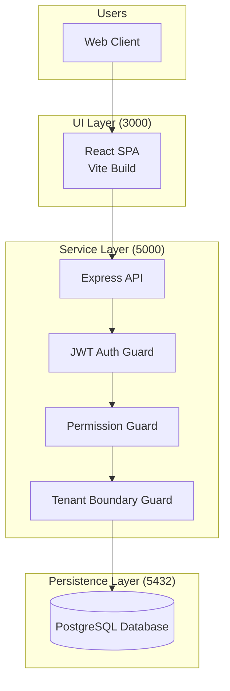
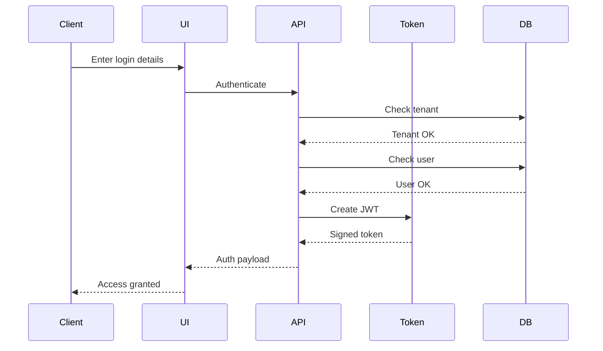
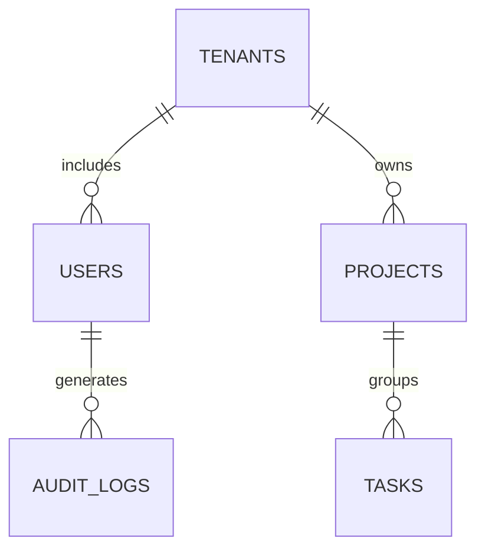
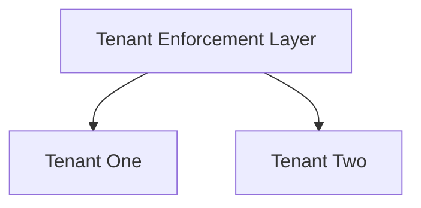

# System Architecture Guide – Version B

## Platform Architecture

### Overall Architecture Diagram



### Layer Responsibilities

**User Access**
- Browsers communicate with the system using HTTP(S)

**UI Layer**
- React-based frontend
- Route-level security enforcement
- Responsive design implementation

**Service Layer**
- Node.js Express backend
- Authentication handled via JWT
- Authorization enforced through RBAC
- Tenant-based data filtering
- Uniform error responses

**Persistence Layer**
- PostgreSQL 15 database
- Tenant-aware relational schema
- Prisma ORM usage
- Schema migrations and seed data

## Login & Token Flow



## Data Model

### Entity Mapping



### Table Descriptions

**Tenants**
- Organization metadata
- Subscription details and limits

**Users**
- Authentication identities
- Tenant-scoped roles

**Projects**
- Tenant-level initiatives

**Tasks**
- Actionable work units

**Audit Logs**
- Operational and security records

## Tenant Data Protection



- Tenant context derived from JWT
- Queries restricted by tenant_id
- Elevated access for super admins
- Database constraints ensure integrity

## API Organization

### Functional Areas
- Authentication
- Tenant administration
- User control
- Project handling
- Task execution
- System health

## Security & Authorization

- JWT-based authentication
- Role validation at middleware
- Tenant scoping before DB access
- Clear separation of responsibilities

## Response Convention

Successful:
```json
{ "success": true, "message": "OK" }
```

Error:
```json
{ "success": false, "message": "Failure reason" }
```
